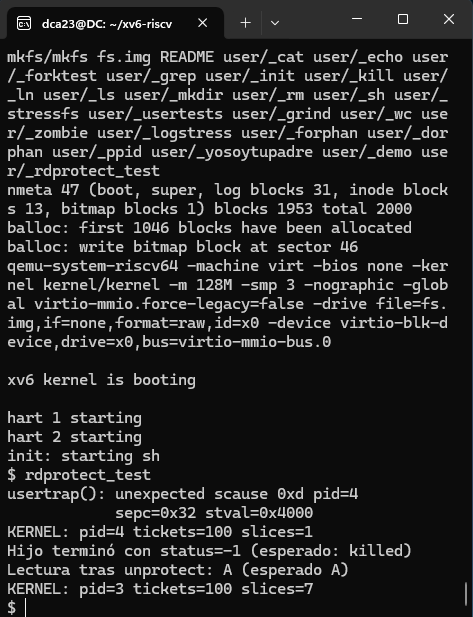

Informe Tarea 3 - Sistemas Operativos 

Daniel Cortes Anjel 30/10/25

Entorno: Windows 11 + WSL (Ubuntu 24.04), QEMU, toolchain RISC-V

## 1. Funcionamiento y lógica de la implementación

Se implementó la syscall mrdprotect(void *addr, int len), la cual marca el rango [addr, addr + len*PGSIZE) como sin lectura, limpiando el bit PTE_R en cada PTE correspondiente. Esta operación conserva los demás bits de permisos y atributos de la entrada (W, X, U, V). La llamada retorna 0 en caso de éxito y -1 ante error.

Asimismo, se implementó la syscall munrdprotect(void *addr, int len), que recorre el mismo rango [addr, addr + len*PGSIZE) restaurando la lectura mediante la activación del bit PTE_R en cada PTE afectada. Al igual que la anterior, retorna 0 en éxito y -1 ante error.

## 2.Explicación de las modificaciones realizadas (archivos y cambios clave)

- Lógica:

Validar len > 0 y addr alineada a página.

Validar que el rango esté dentro de p->sz (espacio usuario del proceso).

Recorrer página a página:

Obtener PTE con walk(pagetable, va, 0).

Exigir PTE_V y PTE_U activos.

Limpiar/restaurar PTE_R.

Ejecutar sfence_vma() para limpiar TLB.

- Archivos modificados:

kernel/syscall.h: nuevos IDs SYS_mrdprotect=25, SYS_munrdprotect=26.

kernel/sysproc.c: implementación de sys_mrdprotect() y sys_munrdprotect().

kernel/syscall.c: declaración extern y registro en syscalls[].

user/user.h: prototipos para espacio de usuario.

user/usys.pl: entradas para generar stubs de las syscalls.

user/rdprotect_test.c: programa de prueba.

Makefile: inclusión de _rdprotect_test en UPROGS.

## 3.Manejo de errores

- Ambas funciones devuelven -1 si:

addr no está alineada a página,

len <= 0,

Alguna dirección está fuera del espacio de usuario,

Alguna página del rango no está mapeada (!PTE_V),

No pertenece a usuario (!PTE_U).

- Observación:

El enunciado habla de memoria “solo escritura”, pero al pedir solo limpiar PTE_R manteniendo W/X/U/V, en RISC-V una PTE con W=1 y R=0 es inválida; por eso no se puede asegurar escritura sin lectura solo con ese cambio. La implementación cumple estrictamente con modificar únicamente PTE_R.

## 4.Ejecución y resultados 

